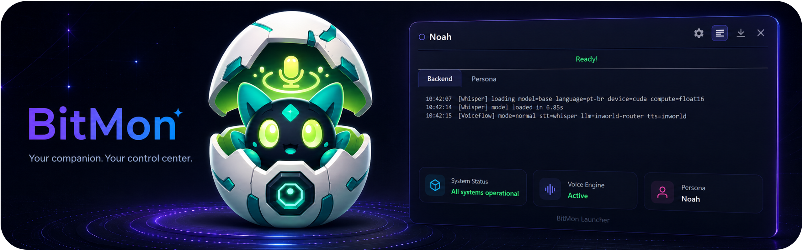
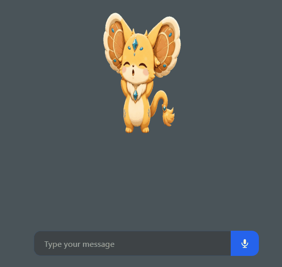

<div align="center">



# BitMon

**A local, voice-driven desktop companion.**
An animated pet lives on your screen, listens when you talk to it, thinks, and
talks back — powered by your choice of cloud (Inworld) or fully-offline
(LM Studio + Kokoro) AI.

</div>

---

<div align="center">

### 🎬 BitMon in action




</div>

---

## ✨ What it does

- **Animated sprite-sheet pet** that sits on top of your desktop and reacts —
  it has separate animations for *idle*, *talking*, *thinking*, *listening*,
  *startup*, *poke* and *error* states.
- **Talk to it by voice.** Push-to-talk with a hotkey, or hands-free with a
  custom **wake word** ("hey ...").
- **It talks back** with synthesized speech and talk animations.
- **Two interchangeable AI backends:**
  - **Inworld** (cloud) — needs an API key, lighter on your machine.
  - **Local** (offline) — LM Studio for the brain + Kokoro for the voice, no
    API key, nothing leaves your computer.
- **Speech-to-text with WhisperX**, running locally on CPU or your NVIDIA GPU.
- **Screen vision** — the pet can look at your screen and answer questions about
  what it sees (optional, toggleable).
- **Home Assistant control** — ask the pet to turn lights/devices on and off.
- **Custom personas** — build your own pet from sprite sheets in a visual editor
  and share them as a ZIP.
- **A friendly desktop launcher** that sets up the Python environment, starts
  everything, and tucks itself into the system tray.

> [!IMPORTANT]
> **You do not need an Inworld key to use BitMon.** Pick the **Local** provider
> and it runs 100% offline. The Inworld key is only required if you choose the
> Inworld provider. See [Providers & requirements](docs/providers.md).

---

## 🚀 Quick start

> **Platform:** Windows 10/11 · **Python:** 3.11 or 3.12 · A microphone.

**The easy way — double-click [`install.bat`](install.bat).** It checks for
Python, asks whether you want CPU or NVIDIA GPU, creates the virtual environment,
installs everything, creates a **BitMon Launcher** desktop shortcut, and offers
to start BitMon when it's done.

After that one-time install, open BitMon from the **BitMon Launcher** shortcut on
your Desktop, or by double-clicking **`start.bat`**.

On the **first launch**, BitMon opens the configuration page on the **Model**
tab automatically so you can pick your provider and model right away. The config
page is always available at:

```
http://127.0.0.1:8000/config
```

<details>
<summary><b>Prefer the command line?</b></summary>

```powershell
python -m venv venv
.\venv\Scripts\activate
# NVIDIA GPU? run this line first:  pip install -r requirements-gpu.txt
pip install -r requirements.txt
python launcher.py
```

</details>

### Which `requirements` file is which?

| File | When it's used | What's in it |
|---|---|---|
| `requirements.txt` | **The one you install.** Always. | A thin pointer that pulls in `requirements-core.txt`. |
| `requirements-core.txt` | Pulled in automatically by `requirements.txt` | The real app dependencies — FastAPI, WhisperX, Kokoro, PySide6, etc. |
| `requirements-gpu.txt` | Optional, NVIDIA only | CUDA builds of PyTorch. Install **before** the others for GPU-accelerated speech. `install.bat` handles this if you pick the GPU option. |

Full, step-by-step instructions (including the LM Studio offline path and the
Inworld key) are in **[docs/installation.md](docs/installation.md)**.

---

## 📚 Documentation

| Guide | What's inside |
|---|---|
| **[Installation](docs/installation.md)** | Prerequisites, GPU vs CPU, virtual environment, first run |
| **[Providers & requirements](docs/providers.md)** | Inworld vs Local, the Inworld API-key disclaimer, GPU/Whisper notes |
| **[The launcher](docs/launcher.md)** | What the launcher window does, tray, logs, advanced view |
| **[Configuration UI — every tab](docs/configuration.md)** | A detailed walkthrough of all tabs and every setting |
| **[Personas & the animation editor](docs/personas.md)** | Building, importing, exporting and activating pets |
| **[Wake word](docs/wake-word.md)** | Hands-free activation and using a custom wake word |
| **[Home Assistant](docs/home-assistant.md)** | Connecting the MCP and the Devices tab |
| **[Troubleshooting](docs/troubleshooting.md)** | Common errors and how to fix them |
| **[Architecture](docs/architecture.md)** | How the pieces fit together (for contributors) |

---

## 🔐 Privacy & security at a glance

- The backend binds to `127.0.0.1` (localhost) only.
- The Inworld API key is stored in your OS credential store via `keyring`, **not**
  in any config file, and the API never returns it.
- `/docs` and the `/mcp` mount are disabled by default.
- With the **Local** provider, audio and text never leave your machine.

More detail in [docs/providers.md](docs/providers.md#privacy) and the repository
`SECURITY.md`.

---

## 🧩 Project layout

```
├── install.bat          # One-time setup (run this first)
├── start.bat            # One-click start (runs the launcher)
├── launcher.py          # Desktop launcher (tray app, starts everything)
├── main.py              # FastAPI app: config UI, APIs, /session websocket
├── core/                # Config store, secrets, security, crash logging
├── services/            # Voice flows, Whisper, TTS, MCP, tools runtime
├── persona/             # PySide overlay pet + persona packages
├── tools/               # Screen capture vision + Home Assistant
├── web/                 # Config UI (config.html), icons, i18n
├── wakeword/            # Bundled wake-word models
└── docs/                # 📖 You are here
```

---

<div align="center">
<sub>Made with FastAPI · PySide6 · WhisperX · Kokoro · Inworld.</sub>
</div>
