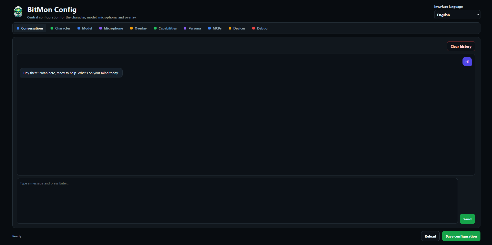
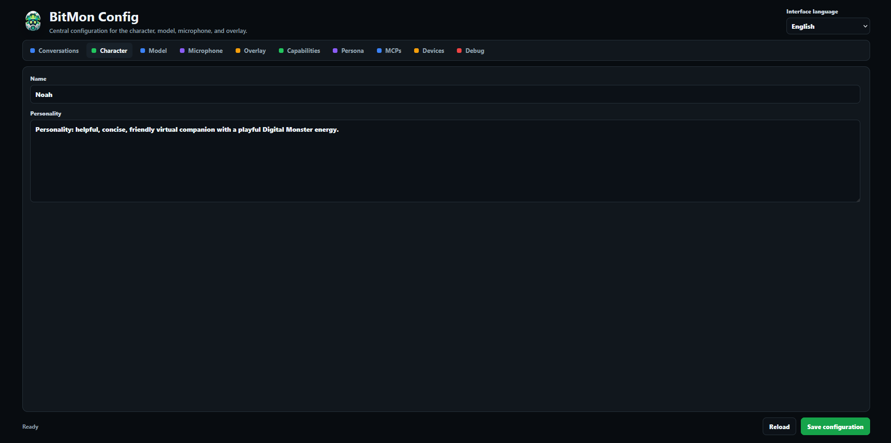

# Configuration UI — every tab

The configuration page is the control center for BitMon. Open it at:

```
http://127.0.0.1:8000/config
```

(or the launcher's ⚙️ button). It's a single page with a row of tabs across the
top. This document walks through **every tab and every setting**.

> [!TIP]
> **Saving.** Most settings only take effect after you press **Save
> configuration** (bottom-right). **Reload** discards unsaved edits and re-reads
> the saved config. A few areas (chat, persona library, device import) have
> their own dedicated buttons and act immediately — those are called out below.

**Language of the UI itself** is chosen with the locale selector in the header
(English and Portuguese ship by default). This only changes the interface
language; the pet's spoken language is set separately under *Model → Languages*.

The tabs:

1. [Conversations](#conversations) · 2. [Character](#character) ·
3. [Model](#model) · 4. [Microphone](#microphone) · 5. [Overlay](#overlay) ·
6. [Capabilities](#capabilities) · 7. [Persona](#persona) ·
8. [Themes](#themes) · 9. [MCPs](#mcps) · 10. [Devices](#devices) ·
11. [Debug](#debug)

---

## Conversations



A text chat with your pet, right inside the config page. Type a message, press
**Enter** (or **Send**), and the pet answers **exactly as if you'd spoken to it**
— it runs the full LLM (and, if voice response is on, speaks and animates too).

- **Clear history** wipes the conversation memory. This is immediate.
- Useful for testing your provider, personality prompt and tools without using
  the microphone.

---

## Character



Who your pet is.

| Field | What it does |
|---|---|
| **Name** | The pet's display name. Shown in the launcher title and tray, and used by the system prompt. |
| **Personality** | A free-text personality/behaviour prompt. This is injected as the system prompt for every reply — describe tone, quirks, what it should/shouldn't do, language style, etc. |

> The personality prompt is the single biggest lever on how your pet "feels".
> Keep it concise but specific.

---

## Model


The most important tab: it picks the AI brain, the voice, and the languages.

### Voice response (top toggle)

- **On** — the pet speaks its replies (TTS) and plays talk animations.
- **Off** — the pet only **prints** the text reply; no audio is synthesized.

### LLM section

| Field | What it does |
|---|---|
| **LLM provider** | **Inworld** (cloud) or **LM Studio** (local). Switching this shows the matching fields below. See [Providers](providers.md). |
| **Inworld API key** | *(Inworld only)* Paste your key here. Leave **blank to keep** the currently saved key. Stored in the OS credential store, never in the config file. |

**When provider = Inworld:**

| Field | What it does |
|---|---|
| **LLM model** | The Inworld Router model id (default `deepseek-v4-flash`). |
| **Screen vision** | How screen analysis is handled: **Auto** (detect from the model), **On** (the model accepts images directly), **Off** (route vision through a fallback vision model). |

**When provider = LM Studio:**

| Field | What it does |
|---|---|
| **LM Studio URL** | The OpenAI-compatible endpoint, default `http://127.0.0.1:1234/v1`. |
| **LM Studio model** | The loaded model. Click **Refresh** to query LM Studio for its currently loaded models. |
| **Temperature** | Creativity/randomness (0–2). Lower = more focused. |
| **Max tokens** | Maximum length of a reply (32–4096). |
| **Screen vision** | Same Auto/On/Off choice as above. |
| **Local vision model** | *(optional)* A separate vision-capable model for screen analysis. Leave blank to use the chat model. |

### TTS section

| Field | What it does |
|---|---|
| **TTS provider** | **Inworld** or **Kokoro** (local). |

**When TTS = Inworld:**

| Field | What it does |
|---|---|
| **Inworld voice** | The Inworld voice name/id used for synthesis. |

**When TTS = Kokoro:**

| Field | What it does |
|---|---|
| **Kokoro model** | The Kokoro model (default `Kokoro-82M`). |
| **Kokoro voice** | The voice preset (e.g. `pf_dora`). |
| **Kokoro language** | Kokoro's language code (e.g. `p` for Portuguese). |
| **Kokoro speed** | Playback speed multiplier (0.5–2). |

### Languages section

| Field | What it does |
|---|---|
| **STT language** | The language WhisperX expects you to **speak**. Match it to your microphone language for best accuracy. |
| **TTS language** | The language the pet **speaks back** in. |

### Whisper section

| Field | What it does |
|---|---|
| **Whisper model** | `tiny` / `base` / `small` / `medium`. Bigger = more accurate, slower on CPU. See [the Whisper/GPU notes](providers.md#whisper--gpu). |

---

## Microphone


Tuning your voice input and how the pet is activated.

### Levels

| Field | What it does |
|---|---|
| **Gain** | Amplifies the microphone signal (1–20). Raise it if you're quiet. |
| **VAD sensitivity** | The voice-activity threshold (0.001–0.1). This is the RMS level above which audio counts as speech. **Lower = more sensitive** (picks up quieter speech, but also more background noise). |

### Real-time monitor

Click **Start test** to see a live level meter with your **gain applied** and the
**threshold** marked. Speak normally and adjust gain/VAD so your voice clears the
threshold line while silence stays below it. Click again to stop.

### Push-to-talk hotkey

| Control | What it does |
|---|---|
| **Add button** | Captures the next key or mouse button you press as the push-to-talk trigger (e.g. `f8`, `mouse4`). |
| **Clear** | Removes the configured hotkey. |

Hold the hotkey to talk; release to send. This is the simplest, most reliable way
to talk to the pet.

### Wake word (hands-free)

| Field | What it does |
|---|---|
| **Wake word** | Toggles hands-free activation on/off. |
| **Activation phrase** | The wake-word model to listen for (bundled or your own). |
| **Activation wait seconds** | After the wake word fires, how long to wait for you to start your command. |
| **Finish silence seconds** | How much trailing silence ends your command and sends it. |

See the dedicated **[Wake word](wake-word.md)** guide, including how to train your
own phrase.

---

## Overlay

The on-screen pet's window behaviour.

| Field | What it does |
|---|---|
| **Always on top** | Keeps the pet above other windows so it's always visible. Turn off to let other windows cover it. |

---

## Capabilities


Toggles for the **tools** the LLM is allowed to call during a conversation.

| Field | What it does |
|---|---|
| **Screen analysis** | Lets the pet capture your screen and answer questions about what's on it. When off, it can't see your screen. |
| **Open configuration** | Lets the pet open this configuration page when asked (e.g. "open your settings"). |

> Home Assistant control is a tool too, but it appears automatically once you
> configure the Home Assistant MCP — see [MCPs](#mcps) and
> [Home Assistant](home-assistant.md).

---

## Persona


Build, manage and activate the **visual pet** — its sprite sheets and
animations. This tab is deep enough to have its own guide:

➡️ **[Personas & the animation editor](personas.md)**

In short, from here you can:

- Switch between personas in your **library**, or create a **New persona**.
- **Activate** a persona (only allowed once it has a valid idle animation with a
  real sprite — see the guide).
- Add **animations** and tune each one (frame size, columns/rows, FPS, type…).
- Upload sprites or import/export personas as ZIP packages.
- **Optimize sprites** to shrink them to WebP.

---

## Themes

Style the **overlay chat** — the speech bubble, the text input and the mic
button. The theme is **global**: it applies to every persona (it is *not* part of
a persona package, so exporting/importing a pet never changes your theme). It is
saved together with the rest of the configuration, and the overlay reloads it
live a second or so after you save.

### Presets and "My themes"

- **Presets** — four ready-made starting points: **Classic** (the original black
  bubble), **Glass** (translucent blue), **Midnight** (deep black, rounded) and
  **Kawaii** (cream/pastel). Click one, then fine-tune the colours below.
- **My themes** — save the current look under a name with **Save current theme**;
  it appears as a card you can click to re-apply, or remove with the **×**.

### Font

| Control | What it does |
|---|---|
| **Subtitle font** | Font used by the subtitle text. *Default (DynaPuff)* is the bundled font; any font you uploaded on the **Persona** tab also shows up here. |
| **Font size** | Subtitle text size, in pixels. |

### Speech bubble

The bubble that shows what you said (`Me:`) and the pet's reply.

| Control | What it does |
|---|---|
| **Text color** | Colour of the reply text. |
| **Background color** | Bubble fill colour. |
| **Border color** | Bubble border colour (only visible when *Border width* > 0). |
| **Gradient background** | When on, the fill blends from *Background color* to *Second color*. |
| **Second color** / **Gradient direction** | The second gradient colour and its direction (vertical / horizontal / diagonal). |
| **Background opacity** | How transparent the bubble is (0–100). |
| **Corner radius** | How rounded the bubble corners are. |
| **Border width** | Bubble border thickness (0 = no border). |
| **Show character name** | When **on**, the reply is prefixed with the pet's name (e.g. `PUGNA:`), coloured by *Name color*; when **off**, no name is shown. |
| **Name color** | Colour of that name prefix. |
| **Spoken word color** | The karaoke colour: while the pet speaks, the word currently being voiced is highlighted in this colour. Pick something that contrasts your theme (the default is red). |

### Text input

The "Type your message" box and the mic button.

| Control | What it does |
|---|---|
| **Text color** | Colour of the text you type. |
| **Background color** | Input fill colour. |
| **Border color** / **Focus border color** | Border colour normally, and when the box is focused. |
| **Gradient background** / **Second color** / **Gradient direction** | Same gradient options as the bubble. |
| **Mic button color** | Fill colour of the microphone button. |
| **Background opacity** | Transparency of the input box (0–100). |
| **Corner radius** | Roundness of the input box and mic button. |
| **Border width** | Input border thickness. |

> Tip: themes are colour-only for now. A more advanced theming system (custom
> layouts) may come later.

---

## MCPs

Connect external **MCP** (Model Context Protocol) servers that the pet can call
as tools.

### Home Assistant

| Control | What it does |
|---|---|
| **Home Assistant MCP URL** | The URL of your Home Assistant MCP endpoint. |
| **Enable Home Assistant** | Turns the integration on. |
| **Validate connection** | Connects to the MCP, refreshes the tool cache, and reports status. |

Once configured, a **Devices** tab appears (see below) and the pet gains a
Home-Assistant control tool. Full walkthrough in
[Home Assistant](home-assistant.md).

### External MCP servers

Add **Streamable HTTP MCP servers** the assistant can use as tools. Each server
can use different auth; some support an OAuth flow you complete from here. This
lets you extend what the pet can *do* beyond the built-in tools.

---

## Devices


> This tab is **hidden until** a Home Assistant MCP is configured and enabled.

Choose **which** Home Assistant entities the pet may control, so it isn't exposed
to your entire house.

| Control | What it does |
|---|---|
| **Search** | Filter by name, entity id, domain, or alias. |
| **Import from MCP** | Pull the current entity list from Home Assistant. |
| **Select all** | Toggle every visible device on/off. |
| **Save devices** | Persist your selection. |

Per row you can enable a device and give it **aliases** (extra names the pet will
recognise, e.g. "the big light"). Details in
[Home Assistant](home-assistant.md).

---

## Debug

Developer/diagnostic toggles.

| Field | What it does |
|---|---|
| **User subtitle** | Show your transcribed speech on-screen (handy to verify STT). |
| **Replay sent audio** | Plays back the audio chunk that was sent for transcription, so you can hear exactly what the mic captured. |

---

## Environment variables

Some behaviour is controlled by environment variables (set before launching).
These are mostly for advanced setups and packaging:

| Variable | Default | Purpose |
|---|---|---|
| `BITMON_HOST` | `127.0.0.1` | Backend bind address |
| `BITMON_PORT` | `8000` | Backend port |
| `BITMON_CONFIG_PATH` | *(in backend folder)* | Path to `bitmon_config.json` |
| `BITMON_LOG_DIR` | `logs/` | Where logs are written |
| `BITMON_CACHE_DIR` | `cache/` | Integration cache folder |
| `BITMON_ENABLE_DOCS` | off | Enable `/docs`, `/redoc`, `/openapi.json` |
| `BITMON_ENABLE_MCP` | off | Enable the `/mcp` HTTP mount |
| `BITMON_ALLOWED_ORIGINS` | local only | Comma-separated CORS origins |

Example:

```powershell
$env:BITMON_PORT="8123"
$env:BITMON_ENABLE_DOCS="1"
python main.py
```

---

Next: **[Personas & the animation editor](personas.md)**.
