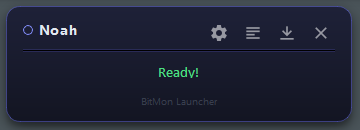
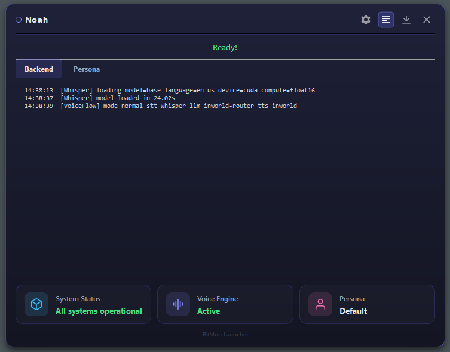

# The launcher

`launcher.py` is the friendly front door to BitMon. It's a small always-on-top
window (PySide6) that sets up the environment, starts and supervises both
processes, streams their logs, and then gets out of your way in the system tray.



```powershell
python launcher.py
```

---

## What it does, in order

1. **Prepares the environment.** If there's no virtual environment yet, it
   creates one and installs `requirements.txt`. It remembers a hash of the
   requirements files, so it only reinstalls when they actually change.
2. **Starts (or reuses) the backend.** If a healthy backend is already running on
   the configured port, it reuses it instead of starting a second one. If the
   port is busy with something else, it tells you.
3. **Waits for health, then readiness.** Two checks: the server is *up*
   (`/health`) and then *ready* with models loaded (`/health/ready`). The status
   line shows *"Loading models…"* during the slower second wait.
4. **Starts the persona overlay.** Your pet appears on screen.
5. **Minimises to the tray** a few seconds after everything is ready.

The window title and tray label use your pet's **name** from the Character tab.

---

## The window controls

The four icons in the title bar:

| Icon | Action |
|---|---|
| ⚙️ | **Open configuration** — opens `http://127.0.0.1:8000/config` in your browser |
| ▤ | **Show/hide advanced** — expands the window to reveal live log tabs |
| ⤓ | **Send to tray** — hides the window; BitMon keeps running |
| ✕ | **Close all** — stops the persona and backend and quits |

Closing the window with the OS close button **does not quit** — it sends BitMon
to the tray. Use ✕ (or the tray menu's *Close*) to fully stop everything.

### System tray

Right-click (or double-click) the tray icon for:

- **Open <pet name>** — restore the launcher window.
- **Open configuration** — the config page.
- **Close** — stop everything and quit.

---

## Advanced view & logs



Click the ▤ button to expand the launcher. You get two live tabs:

- **Backend logs** — the FastAPI process: voice flow timings, provider errors,
  Whisper/TTS timing, etc.
- **Persona logs** — the overlay process.

These are the same streams written to disk under `logs/`:

| Log file | Contents |
|---|---|
| `logs/backend-process.log` | Everything the backend prints |
| `logs/persona-process.log` | Everything the overlay prints |
| `logs/setup.log` | Dependency installation output |

When the launcher reuses an already-running backend, it tails the existing
backend log so you still see recent history.

If startup **fails** at any step, the launcher automatically expands to the
advanced view and shows the error in red, so you can read the logs immediately.

---

## Running pieces manually

The launcher is optional. You can run the two processes yourself:

```powershell
# Terminal 1 — backend (config UI + APIs + voice websocket)
python main.py

# Terminal 2 — the pet overlay
python persona\personagem.py
```

This is handy for development or when you want full console output.

---

## Environment & paths

The launcher passes these to the child processes (you can override any of them
before launching — see
[Configuration → Environment variables](configuration.md#environment-variables)):

- `BITMON_HOST` / `BITMON_PORT` — where the backend binds (default
  `127.0.0.1:8000`).
- `BITMON_CONFIG_PATH` — your `bitmon_config.json`.
- `BITMON_LOG_DIR` — the `logs/` folder.
- `BITMON_CACHE_DIR` — the integration `cache/` folder.

When run from source these all resolve **inside the backend folder**, which keeps
a published/standalone copy self-contained. (When packaged as an installed app
they move under `%LOCALAPPDATA%\BitMon`.)

> [!NOTE]
> **Launcher icon.** The window/tray icon is loaded from `web/app-icon.ico` and
> `web/app-icon.png`, both of which ship inside the backend — so the launcher
> shows its icon even when the `backend` folder is published on its own. To
> change it, replace those two files.

---

Next: **[Configuration UI — every tab](configuration.md)**.
