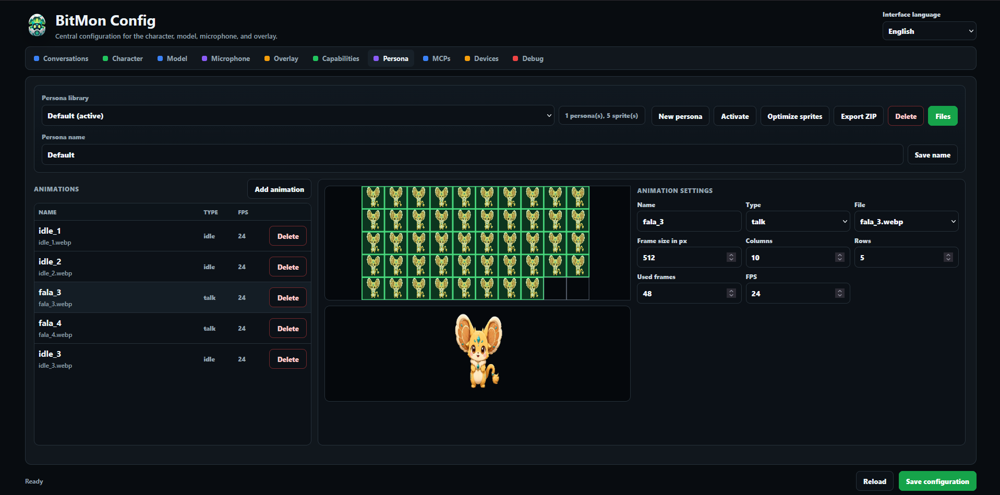

# Personas & the animation editor

A **persona** is your pet's body: a set of sprite-sheet **animations** plus the
config that describes how to play them. BitMon ships with a default persona, and
you can build, import, share and switch between as many as you like — all from
the **Persona** tab.

---

## Concepts

- A **persona** is a self-contained package: a `persona_config.json` plus a folder
  of **sprite** images.
- Each persona has a list of **animations**. Every animation points at one sprite
  sheet and has a **type** (its *kind*) that tells the overlay *when* to play it.
- The active persona is the one currently shown on your desktop.

### Sprite sheets

Each animation's image is a **sprite sheet**: a grid of frames laid out in
**columns × rows**. The overlay plays the frames in order at the configured FPS.
You describe the layout with these fields (see [the editor](#the-animation-editor)):
frame size, columns, rows and how many of the grid cells are actually used.

Supported sprite formats: **PNG, JPG/JPEG, WebP**.

---

## Animation types (kinds)

The **Type** of an animation decides when the overlay plays it. You can have
**more than one** animation of the same type — the overlay picks from the pool.

| Type | When it plays | Loops? |
|---|---|---|
| **idle** | The default resting state, when nothing else is happening. **Required.** | Loops |
| **talk** | While the pet is speaking a reply. **Required** (falls back to a bundled one if missing). | Loops |
| **thinking** | While the LLM is generating an answer. | Loops |
| **listening** | While the microphone is actively capturing your command. | Loops |
| **start** | A one-time intro played when the pet first appears. | Plays once |
| **poke** | A one-time reaction when you click/poke the pet. | Plays once |
| **error** | A one-time reaction when something goes wrong (e.g. provider error). | Plays once |

**Graceful fallbacks:** if a type has no animation, the overlay substitutes a
related one — `listening → thinking → idle`, and `start → idle`. So at minimum a
persona needs a good **idle** (and ideally **talk**); the rest are enhancements.

### Idle delay

Idle animations have an extra **Idle delay (s)** field. With multiple idle
animations you can make some only appear after the pet has been idle for a while
(e.g. a "bored", "sleepy" or fidget animation after 30 s). `0` means the
animation is always eligible.

> The **Idle delay** field only appears in the editor when the **Type** is
> `idle` — other types don't use it.

---

## The persona library

The top row of the Persona tab manages **whole personas**:

| Button | What it does |
|---|---|
| **New persona** | Creates a brand-new, **empty** persona (no animations, no sprites). You give it a name. |
| **Activate** | Makes the selected persona the live one on your desktop. |
| **Optimize sprites** | Converts/compacts the persona's sprites to WebP to save space. |
| **Export ZIP** | Downloads the persona as a shareable `.zip` package. |
| **Delete** | Removes the selected persona (the default persona can't be deleted). |
| **Files** | Opens a dialog to **upload sprites** or **import a persona ZIP**. |

The line next to the picker shows a summary like *"2 persona(s), 5 sprites"* and,
if the persona can't be activated yet, *"needs an idle animation to activate"*.

> [!IMPORTANT]
> **A persona can only be activated once it has a working idle animation** — that
> means an animation of type **idle** whose sprite file **actually exists** in the
> persona's sprites. A freshly created (empty) persona, or one whose idle points
> at a sprite you never uploaded, **cannot be activated**: the **Activate** button
> stays disabled and the backend rejects the request with an error toast. Add an
> idle animation with a real sprite first.

**Persona name** (second row) renames the selected persona; click **Save name**
to apply.

---

## The animation editor

Below the library is the editor for the **selected persona's animations**.

- The **Animations** list (left) shows each animation with its name, type and FPS.
  Select one to edit it; use **Add animation** to create a new one.
- The **previews** (center) show the full **sprite sheet** on top and a **live,
  animated** preview of the current animation below, so you can confirm the grid
  and timing look right.
- **Animation settings** (right) is where you describe the sheet:

| Field | Meaning |
|---|---|
| **Name** | A label for this animation (free text). |
| **Type** | The kind — `idle`, `talk`, `thinking`, `listening`, `start`, `poke`, `error`. |
| **File** | Which uploaded sprite this animation uses. |
| **Frame size in px** | The width/height of a single frame in the sheet. |
| **Columns** | Number of frames across the sheet. |
| **Rows** | Number of frame rows in the sheet. |
| **Used frames** | How many cells of the `columns × rows` grid are actually animation frames (the rest are blank/padding). |
| **FPS** | Playback speed in frames per second. |
| **Idle delay (s)** | *(idle type only)* Seconds idle before this animation becomes eligible; `0` = always. |

Press **Save configuration** (bottom-right) to persist your animation edits, or
**Reload** to discard them.

---

## Building a persona — step by step

1. **New persona** → give it a name. It starts empty.
2. **Files → Upload sprite** → add at least one sprite sheet (e.g. your idle
   animation).
3. **Add animation** → set **Type = idle**, pick the **File**, and fill in
   **Frame size / Columns / Rows / Used frames / FPS** to match your sheet. Watch
   the live preview until it looks right.
4. Repeat for **talk** and any other types you want.
5. **Save configuration.**
6. **Activate** the persona — it now appears on your desktop.

> [!TIP]
> Not sure of the grid numbers? Start with the real **Columns**/**Rows** of your
> sheet and set **Used frames** to `columns × rows`, then trim **Used frames**
> down if the last cells are blank. The previews update as you type.

---

## Sharing personas

- **Export ZIP** produces a package with the `persona_config.json` and all
  sprites. Send it to a friend.
- They use **Files → Import persona ZIP** to add it to their library.

This is the easiest way to distribute custom pets.

---

## Optimizing sprites

**Optimize sprites** re-encodes the persona's images to **WebP**, which is much
smaller than PNG with no visible quality loss for sprite art. Run it before
exporting to keep your shared packages small.

---

Next: **[Wake word](wake-word.md)**.
